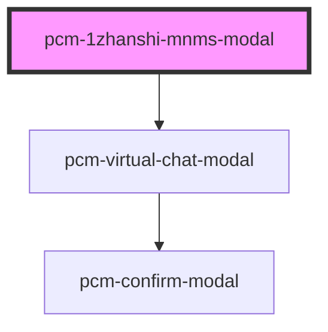

<!-- Auto Generated Below -->

## Overview

模拟面试

## Properties

| Property             | Attribute              | Description                                                                                                                                                                                                                                                                                                                                            | Type                       | Default     |
| -------------------- | ---------------------- | ------------------------------------------------------------------------------------------------------------------------------------------------------------------------------------------------------------------------------------------------------------------------------------------------------------------------------------------------------ | -------------------------- | ----------- |
| `conversationId`     | `conversation-id`      | 会话ID，传入继续对话，否则创建新会话                                                                                                                                                                                                                                                                                                                                    | `string`                   | `undefined` |
| `customInputs`       | `custom-inputs`        | 自定义输入参数，传入customInputs.job_info时，会隐藏JD输入区域                                                                                                                                                                                                                                                                                                          | `{ [x: string]: string; }` | `{}`        |
| `defaultQuery`       | `default-query`        | 默认查询文本                                                                                                                                                                                                                                                                                                                                                 | `string`                   | `'请开始模拟面试'` |
| `digitalId`          | `digital-id`           | 虚拟数字人ID，指定则开启虚拟数字人功能                                                                                                                                                                                                                                                                                                                                   | `string`                   | `undefined` |
| `enableVirtualHuman` | `enable-virtual-human` | 是否启用全屏虚拟数字人模式，此模式下面试结果只会通过interviewComplete事件返回或者通过url_callback回调返回                                                                                                                                                                                                                                                                                    | `boolean`                  | `false`     |
| `fullscreen`         | `fullscreen`           | 是否以全屏模式打开，移动端建议设置为true                                                                                                                                                                                                                                                                                                                                 | `boolean`                  | `false`     |
| `icon`               | `icon`                 | 应用图标URL                                                                                                                                                                                                                                                                                                                                                | `string`                   | `undefined` |
| `isNeedClose`        | `is-need-close`        | 是否展示右上角的关闭按钮                                                                                                                                                                                                                                                                                                                                           | `boolean`                  | `true`      |
| `isOpen`             | `is-open`              | 是否显示聊天模态框                                                                                                                                                                                                                                                                                                                                              | `boolean`                  | `false`     |
| `isShowHeader`       | `is-show-header`       | 是否展示顶部标题栏                                                                                                                                                                                                                                                                                                                                              | `boolean`                  | `true`      |
| `maxRecordingTime`   | `max-recording-time`   | 视频录制最大时长（秒）默认120                                                                                                                                                                                                                                                                                                                                       | `number`                   | `120`       |
| `modalTitle`         | `modal-title`          | 模态框标题                                                                                                                                                                                                                                                                                                                                                  | `string`                   | `'模拟面试'`    |
| `openingIndex`       | `opening-index`        | 数字人开场白索引，用于选择开场白和开场视频（可选：0, 1, 2） 0、您好，我是聘才猫 AI 面试助手。很高兴为你主持这场面试！在开始前，请确保：身处安静、光线充足的环境。网络顺畅，摄像头和麦克风工作正常。现在我正在查看本次面试的相关信息，为您生成专属面试题，马上就好，请稍等片刻。  1、您好，我是您的 AI 面试助手。欢迎参加本次AI面试！为了获得最佳效果，请确认：您在安静、明亮的环境中。您的网络稳定，摄像头和麦克风已开启。我们正在后台为您准备本次专属面试内容，很快开始，请稍候。  2、您好，我是您的 AI 面试助手。面试马上开始。趁此片刻，请快速确认：周围安静吗？光线足够吗？网络没问题？摄像头和麦克风准备好了吗？我们正在为您加载个性化的面试环节，稍等就好！ | `number`                   | `0`         |
| `token` _(required)_ | `token`                | SDK鉴权密钥                                                                                                                                                                                                                                                                                                                                                | `string`                   | `undefined` |
| `zIndex`             | `z-index`              | 聊天框的页面层级                                                                                                                                                                                                                                                                                                                                               | `number`                   | `1000`      |

## Events

| Event               | Description             | Type                                      |
| ------------------- | ----------------------- | ----------------------------------------- |
| `conversationStart` | 新会话开始的回调，只会在一轮对话开始时触发一次 | `CustomEvent<ConversationStartEventData>` |
| `interviewComplete` | 当聊天完成时触发                | `CustomEvent<InterviewCompleteEventData>` |
| `modalClosed`       | 当点击模态框关闭时触发             | `CustomEvent<void>`                       |
| `recordingError`    | 录制错误事件                  | `CustomEvent<RecordingErrorEventData>`    |
| `someErrorEvent`    | 错误事件                    | `CustomEvent<ErrorEventDetail>`           |
| `streamComplete`    | 流式输出完成事件                | `CustomEvent<StreamCompleteEventData>`    |
| `tokenInvalid`      | SDK密钥验证失败事件             | `CustomEvent<void>`                       |
| `uploadSuccess`     | 上传成功事件                  | `CustomEvent<FileUploadResponse>`         |

## Dependencies

### Depends on

- [pcm-virtual-chat-modal](../pcm-virtual-chat-modal)

### Graph

----------------------------------------------

*Built with [StencilJS](https://stenciljs.com/)*
