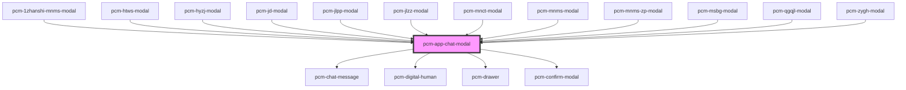

<!-- Auto Generated Below -->

## Properties

| Property                 | Attribute                   | Description                                 | Type                    | Default                                                    |
| ------------------------ | --------------------------- | ------------------------------------------- | ----------------------- | ---------------------------------------------------------- |
| `assistantAvatar`        | `assistant-avatar`          | 助手头像URL                                     | `string`                | `undefined`                                                |
| `botId`                  | `bot-id`                    | 机器人ID                                       | `string`                | `undefined`                                                |
| `closeResume`            | `close-resume`              |                                             | `() => void`            | `undefined`                                                |
| `conversationId`         | `conversation-id`           | 会话ID，传入继续对话，否则创建新会话                         | `string`                | `undefined`                                                |
| `countdownWarningTime`   | `countdown-warning-time`    | 录制倒计时提醒时间（秒） 当剩余时间小于此值时，显示倒计时警告             | `number`                | `30`                                                       |
| `customInputs`           | `custom-inputs`             | 自定义智能体inputs输入参数                            | `{ [x: string]: any; }` | `{}`                                                       |
| `defaultQuery`           | `default-query`             | 默认发送文本                                      | `string`                | `'你好！聘才猫'`                                                 |
| `digitalId`              | `digital-id`                | 虚拟数字人ID，指定则开启虚拟数字人功能                        | `string`                | `undefined`                                                |
| `filePreviewMode`        | `file-preview-mode`         | 附件预览模式 'drawer': 在右侧抽屉中预览 'window': 在新窗口中打开 | `"drawer" \| "window"`  | `'drawer'`                                                 |
| `fullscreen`             | `fullscreen`                | 是否以全屏模式打开，移动端建议设置为true                      | `boolean`               | `false`                                                    |
| `icon`                   | `icon`                      | 应用图标URL                                     | `string`                | `undefined`                                                |
| `interviewMode`          | `interview-mode`            | 聊天模式 video: 视频聊天模式 text: 文字聊天模式             | `"text" \| "video"`     | `'video'`                                                  |
| `isNeedClose`            | `is-need-close`             | 是否展示右上角的关闭按钮                                | `boolean`               | `true`                                                     |
| `isOpen`                 | `is-open`                   | 是否显示聊天模态框                                   | `boolean`               | `false`                                                    |
| `isShowHeader`           | `is-show-header`            | 是否展示顶部标题栏                                   | `boolean`               | `true`                                                     |
| `maxAudioRecordingTime`  | `max-audio-recording-time`  | 语音录制最大时长（秒）                                 | `number`                | `60`                                                       |
| `maxRecordingTime`       | `max-recording-time`        | 视频录制最大时长（秒）                                 | `number`                | `120`                                                      |
| `modalTitle`             | `modal-title`               | 模态框标题                                       | `string`                | `'在线客服'`                                                   |
| `showCopyButton`         | `show-copy-button`          | 是否显示复制按钮                                    | `boolean`               | `true`                                                     |
| `showEndInterviewButton` | `show-end-interview-button` | 是否显示结束面试按钮                                  | `boolean`               | `false`                                                    |
| `showFeedbackButtons`    | `show-feedback-buttons`     | 是否显示点赞点踩按钮                                  | `boolean`               | `true`                                                     |
| `showWorkspaceHistory`   | `show-workspace-history`    | 是否显示工作区历史会话按钮                               | `boolean`               | `false`                                                    |
| `token`                  | `token`                     | SDK鉴权密钥                                     | `string`                | `undefined`                                                |
| `userAvatar`             | `user-avatar`               | 用户头像URL                                     | `string`                | `'https://pub.pincaimao.com/static/common/i_pcm_logo.png'` |
| `waitingTime`            | `waiting-time`              | 等待录制时间（秒）                                   | `number`                | `10`                                                       |
| `zIndex`                 | `z-index`                   | 聊天框的页面层级                                    | `number`                | `undefined`                                                |

## Events

| Event                   | Description             | Type                                          |
| ----------------------- | ----------------------- | --------------------------------------------- |
| `conversationStart`     | 新会话开始的回调，只会在一轮对话开始时触发一次 | `CustomEvent<ConversationStartEventData>`     |
| `interviewComplete`     | 当聊天完成时触发                | `CustomEvent<InterviewCompleteEventData>`     |
| `modalClosed`           | 当点击模态框关闭时触发             | `CustomEvent<void>`                           |
| `recordingError`        | 录制错误事件                  | `CustomEvent<RecordingErrorEventData>`        |
| `recordingStatusChange` | 录制状态变化事件                | `CustomEvent<RecordingStatusChangeEventData>` |
| `streamComplete`        | 一轮对话结束时的回调              | `CustomEvent<StreamCompleteEventData>`        |
| `tokenInvalid`          | SDK密钥验证失败事件             | `CustomEvent<void>`                           |

## Dependencies

### Used by

 - [pcm-1zhanshi-mnms-modal](../pcm-1zhanshi-mnms-modal)
 - [pcm-htws-modal](../pcm-htws-modal)
 - [pcm-hyzj-modal](../pcm-hyzj-modal)
 - [pcm-jd-modal](../pcm-jd-modal)
 - [pcm-jlpp-modal](../pcm-jlpp-modal)
 - [pcm-jlzz-modal](../pcm-jlzz-modal)
 - [pcm-mnct-modal](../pcm-mnct-modal)
 - [pcm-mnms-modal](../pcm-mnms-modal)
 - [pcm-mnms-zp-modal](../pcm-mnms-zp-modal)
 - [pcm-msbg-modal](../pcm-msbg-modal)
 - [pcm-qgqjl-modal](../pcm-qgqjl-modal)
 - [pcm-zygh-modal](../pcm-zygh-modal)

### Depends on

- [pcm-chat-message](../pcm-chat-message)
- [pcm-digital-human](../pcm-digital-human)
- [pcm-drawer](../pcm-drawer)
- [pcm-confirm-modal](../pcm-confirm-modal)

### Graph

----------------------------------------------

*Built with [StencilJS](https://stenciljs.com/)*
