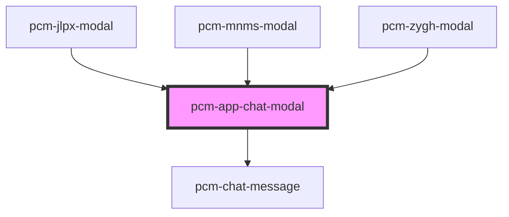

<!-- Auto Generated Below -->

## Properties

| Property               | Attribute                | Description                           | Type                    | Default     |
| ---------------------- | ------------------------ | ------------------------------------- | ----------------------- | ----------- |
| `apiKey`               | `api-key`                | API鉴权密钥                               | `string`                | `''`        |
| `botId`                | `bot-id`                 | 机器人ID                                 | `string`                | `undefined` |
| `conversationId`       | `conversation-id`        | 会话ID，传入继续对话，否则创建新会话                   | `string`                | `undefined` |
| `countdownWarningTime` | `countdown-warning-time` | 录制倒计时提醒时间（秒） 当剩余时间小于此值时，显示倒计时警告       | `number`                | `30`        |
| `customInputs`         | --                       | 自定义智能体inputs输入参数                      | `{ [x: string]: any; }` | `{}`        |
| `defaultQuery`         | `default-query`          | 默认查询文本                                | `string`                | `''`        |
| `displayContentStatus` | `display-content-status` | 是否显示题干内容 1: 显示题干内容 0: 不显示题干内容         | `string`                | `"1"`       |
| `enableTTS`            | `enable-t-t-s`           | 是否启用语音播报功能 true: 启用语音合成 false: 禁用语音合成 | `boolean`               | `false`     |
| `enableVoice`          | `enable-voice`           | 是否自动播放语音问题                            | `boolean`               | `false`     |
| `fullscreen`           | `fullscreen`             | 是否以全屏模式打开，移动端建议设置为true                | `boolean`               | `false`     |
| `icon`                 | `icon`                   | 应用图标URL                               | `string`                | `undefined` |
| `interviewMode`        | `interview-mode`         | 面试模式 video: 视频面试模式 text: 文字面试模式       | `"text" \| "video"`     | `'video'`   |
| `isNeedClose`          | `is-need-close`          | 是否展示右上角的关闭按钮                          | `boolean`               | `true`      |
| `isOpen`               | `is-open`                | 是否显示聊天模态框                             | `boolean`               | `false`     |
| `isShowHeader`         | `is-show-header`         | 是否展示顶部标题栏                             | `boolean`               | `true`      |
| `maxRecordingTime`     | `max-recording-time`     | 视频录制最大时长（秒）                           | `number`                | `120`       |
| `modalTitle`           | `modal-title`            | 模态框标题                                 | `string`                | `'在线客服'`    |
| `totalQuestions`       | `total-questions`        | 控制对话轮数                                | `number`                | `2`         |
| `zIndex`               | `z-index`                | 聊天框的页面层级                              | `number`                | `1000`      |

## Events

| Event                   | Description             | Type                                                                                                   |
| ----------------------- | ----------------------- | ------------------------------------------------------------------------------------------------------ |
| `conversationStart`     | 新会话开始的回调，只会在一轮对话开始时触发一次 | `CustomEvent<{ conversation_id: string; event: string; message_id: string; id: string; }>`             |
| `interviewComplete`     | 当聊天完成时触发                | `CustomEvent<{ conversation_id: string; total_questions: number; }>`                                   |
| `modalClosed`           | 当点击模态框关闭时触发             | `CustomEvent<void>`                                                                                    |
| `recordingError`        | 录制错误事件                  | `CustomEvent<{ type: string; message: string; details?: any; }>`                                       |
| `recordingStatusChange` | 录制状态变化事件                | `CustomEvent<{ status: "started" \| "stopped" \| "paused" \| "resumed" \| "failed"; details?: any; }>` |
| `streamComplete`        | 一轮对话结束时的回调              | `CustomEvent<{ conversation_id: string; event: string; message_id: string; id: string; }>`             |

## Dependencies

### Used by

 - [pcm-jlpx-modal](../pcm-jlpx-modal)
 - [pcm-mnms-modal](../pcm-mnms-modal)
 - [pcm-zygh-modal](../pcm-zygh-modal)

### Depends on

- [pcm-chat-message](../pcm-chat-message)

### Graph

----------------------------------------------

*Built with [StencilJS](https://stenciljs.com/)*
