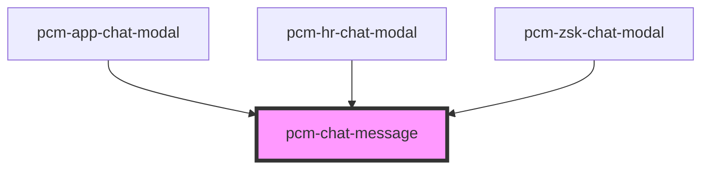

<!-- Auto Generated Below -->

## Properties

| Property               | Attribute                | Description                                 | Type                   | Default     |
| ---------------------- | ------------------------ | ------------------------------------------- | ---------------------- | ----------- |
| `assistantAvatar`      | `assistant-avatar`       | 助手头像URL                                     | `string`               | `undefined` |
| `botId`                | `bot-id`                 | 机器人ID                                       | `string`               | `undefined` |
| `filePreviewMode`      | `file-preview-mode`      | 附件预览模式 'drawer': 在右侧抽屉中预览 'window': 在新窗口中打开 | `"drawer" \| "window"` | `'window'`  |
| `message`              | `message`                | 消息数据                                        | `ChatMessage`          | `undefined` |
| `saveJdButtonText`     | `save-jd-button-text`    | 保存职位按钮文本                                    | `string`               | `'保存职位'`    |
| `showAssistantMessage` | `show-assistant-message` | 是否显示助手消息内容 false时显示加载中动画，true时显示正常消息内容      | `boolean`              | `true`      |
| `showCopyButton`       | `show-copy-button`       | 是否显示复制按钮                                    | `boolean`              | `true`      |
| `showFeedbackButtons`  | `show-feedback-buttons`  | 是否显示点赞点踩按钮                                  | `boolean`              | `true`      |
| `showSaveJdButton`     | `show-save-jd-button`    | 是否显示“保存职位”按钮（仅JD助手智能体生效）                    | `boolean`              | `false`     |
| `userAvatar`           | `user-avatar`            | 用户头像URL                                     | `string`               | `undefined` |

## Events

| Event                | Description | Type                                                                                                              |
| -------------------- | ----------- | ----------------------------------------------------------------------------------------------------------------- |
| `filePreviewRequest` |             | `CustomEvent<{ url?: string; fileName: string; content?: string; contentType: "text" \| "file" \| "markdown"; }>` |
| `retryRequest`       | 重试事件        | `CustomEvent<string>`                                                                                             |
| `saveJd`             | 保存职位事件      | `CustomEvent<{ isOk: boolean; message?: string; data?: Record<string, string>; }>`                                |

## Dependencies

### Used by

 - [pcm-app-chat-modal](../pcm-app-chat-modal)
 - [pcm-hr-chat-modal](../pcm-hr-chat-modal)
 - [pcm-zsk-chat-modal](../pcm-zsk-chat-modal)

### Graph

----------------------------------------------

*Built with [StencilJS](https://stenciljs.com/)*
