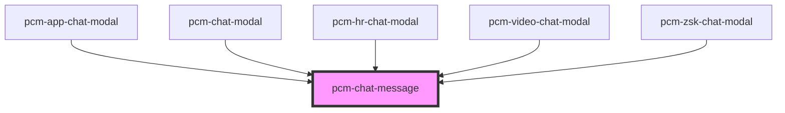

<!-- Auto Generated Below -->

## Properties

| Property              | Attribute               | Description | Type          | Default     |
| --------------------- | ----------------------- | ----------- | ------------- | ----------- |
| `assistantAvatar`     | `assistant-avatar`      | 助手头像URL     | `string`      | `undefined` |
| `botId`               | `bot-id`                | 机器人ID       | `string`      | `undefined` |
| `message`             | `message`               | 消息数据        | `ChatMessage` | `undefined` |
| `showFeedbackButtons` | `show-feedback-buttons` | 是否显示点赞点踩按钮  | `boolean`     | `true`      |
| `token`               | `token`                 | SDK鉴权密钥     | `string`      | `''`        |
| `userAvatar`          | `user-avatar`           | 用户头像URL     | `string`      | `undefined` |

## Events

| Event           | Description | Type                                                                                                                                                                                                                                                                                                                                                                   |
| --------------- | ----------- | ---------------------------------------------------------------------------------------------------------------------------------------------------------------------------------------------------------------------------------------------------------------------------------------------------------------------------------------------------------------------- |
| `messageChange` | 消息变更事件      | `CustomEvent<{ id?: string; conversation_id?: string; parent_message_id?: string; inputs?: Record<string, any>; query?: string; answer?: string; message_files?: any[]; feedback?: Record<string, any>; retriever_resources?: any[]; created_at?: string; agent_thoughts?: any[]; status?: "error" \| "normal"; error?: any; time?: string; isStreaming?: boolean; }>` |

## Dependencies

### Used by

 - [pcm-app-chat-modal](../pcm-app-chat-modal)
 - [pcm-chat-modal](../pcm-chat-modal)
 - [pcm-hr-chat-modal](../pcm-hr-chat-modal)
 - [pcm-video-chat-modal](../pcm-video-chat-modal)
 - [pcm-zsk-chat-modal](../pcm-zsk-chat-modal)

### Graph

----------------------------------------------

*Built with [StencilJS](https://stenciljs.com/)*
