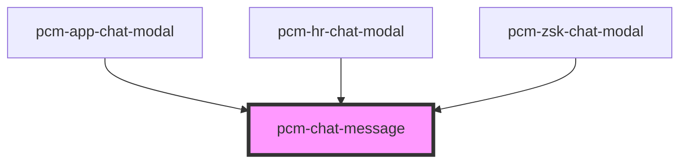

<!-- Auto Generated Below -->

## Properties

| Property              | Attribute               | Description                                 | Type                   | Default     |
| --------------------- | ----------------------- | ------------------------------------------- | ---------------------- | ----------- |
| `assistantAvatar`     | `assistant-avatar`      | 助手头像URL                                     | `string`               | `undefined` |
| `botId`               | `bot-id`                | 机器人ID                                       | `string`               | `undefined` |
| `filePreviewMode`     | `file-preview-mode`     | 附件预览模式 'drawer': 在右侧抽屉中预览 'window': 在新窗口中打开 | `"drawer" \| "window"` | `'window'`  |
| `message`             | `message`               | 消息数据                                        | `ChatMessage`          | `undefined` |
| `showCopyButton`      | `show-copy-button`      | 是否显示复制按钮                                    | `boolean`              | `true`      |
| `showFeedbackButtons` | `show-feedback-buttons` | 是否显示点赞点踩按钮                                  | `boolean`              | `true`      |
| `userAvatar`          | `user-avatar`           | 用户头像URL                                     | `string`               | `undefined` |

## Events

| Event                | Description | Type                                                                                                                                                                                                                                                                                                                                                                                              |
| -------------------- | ----------- | ------------------------------------------------------------------------------------------------------------------------------------------------------------------------------------------------------------------------------------------------------------------------------------------------------------------------------------------------------------------------------------------------- |
| `filePreviewRequest` |             | `CustomEvent<{ url?: string; fileName: string; content?: string; contentType: "text" \| "file" \| "markdown"; }>`                                                                                                                                                                                                                                                                                 |
| `messageChange`      | 消息变更事件      | `CustomEvent<{ id?: string; conversation_id?: string; parent_message_id?: string; inputs?: Record<string, any>; query?: string; answer?: string; message_files?: any[]; feedback?: Record<string, any>; retriever_resources?: any[]; created_at?: string; agent_thoughts?: any[]; status?: "error" \| "normal"; error?: any; time?: string; isStreaming?: boolean; showRetryButton?: boolean; }>` |
| `retryRequest`       | 重试事件        | `CustomEvent<string>`                                                                                                                                                                                                                                                                                                                                                                             |

## Dependencies

### Used by

 - [pcm-app-chat-modal](../pcm-app-chat-modal)
 - [pcm-hr-chat-modal](../pcm-hr-chat-modal)
 - [pcm-zsk-chat-modal](../pcm-zsk-chat-modal)

### Graph

----------------------------------------------

*Built with [StencilJS](https://stenciljs.com/)*
