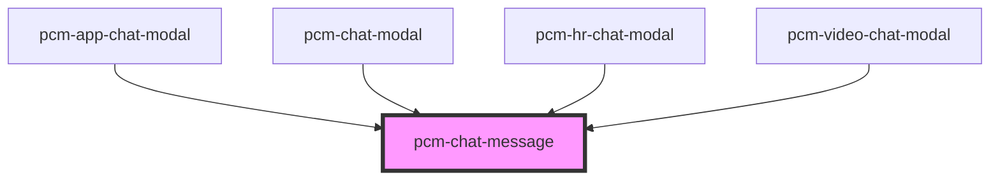

<!-- Auto Generated Below -->

## Properties

| Property  | Attribute | Description | Type          | Default     |
| --------- | --------- | ----------- | ------------- | ----------- |
| `message` | --        | 消息数据        | `ChatMessage` | `undefined` |

## Events

| Event           | Description | Type                                                                                                                                                                                                                       |
| --------------- | ----------- | -------------------------------------------------------------------------------------------------------------------------------------------------------------------------------------------------------------------------- |
| `messageChange` | 消息变更事件      | `CustomEvent<{ id?: string; query?: string; answer?: string; time?: string; conversation_id?: string; isStreaming?: boolean; bot_id?: string; inputs?: Record<string, any>; status?: "error" \| "normal"; error?: any; }>` |

## Dependencies

### Used by

 - [pcm-app-chat-modal](../pcm-app-chat-modal)
 - [pcm-chat-modal](../pcm-chat-modal)
 - [pcm-hr-chat-modal](../pcm-hr-chat-modal)
 - [pcm-video-chat-modal](../pcm-video-chat-modal)

### Graph

----------------------------------------------

*Built with [StencilJS](https://stenciljs.com/)*
