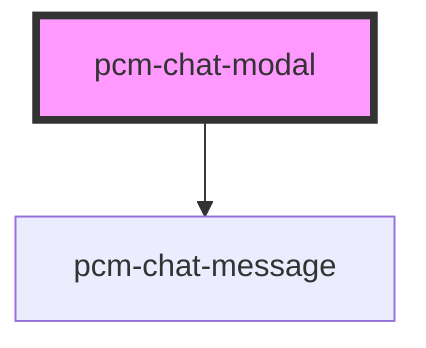

<!-- Auto Generated Below -->

## Properties

| Property         | Attribute         | Description  | Type               | Default     |
| ---------------- | ----------------- | ------------ | ------------------ | ----------- |
| `botId`          | `bot-id`          | 机器人ID        | `string`           | `undefined` |
| `conversationId` | `conversation-id` | 会话ID         | `string`           | `undefined` |
| `icon`           | `icon`            | 应用图标URL      | `string`           | `undefined` |
| `isNeedClose`    | `is-need-close`   | 是否展示右上角的关闭按钮 | `boolean`          | `true`      |
| `isOpen`         | `is-open`         | 是否显示聊天模态框    | `boolean`          | `false`     |
| `isShowHeader`   | `is-show-header`  | 是否展示顶部标题栏    | `boolean`          | `true`      |
| `layout`         | `layout`          | 聊天框窗口的布局风格   | `"mobile" \| "pc"` | `'pc'`      |
| `modalTitle`     | `modal-title`     | 模态框标题        | `string`           | `'在线客服'`    |
| `zIndex`         | `z-index`         | 聊天框的页面层级     | `number`           | `1000`      |

## Events

| Event            | Description | Type                                                                                       |
| ---------------- | ----------- | ------------------------------------------------------------------------------------------ |
| `messageSent`    | 当发送消息时触发    | `CustomEvent<string>`                                                                      |
| `modalClosed`    | 当模态框关闭时触发   | `CustomEvent<void>`                                                                        |
| `streamComplete` |             | `CustomEvent<{ conversation_id: string; event: string; message_id: string; id: string; }>` |

## Dependencies

### Depends on

- [pcm-chat-message](../pcm-chat-message)

### Graph

----------------------------------------------

*Built with [StencilJS](https://stenciljs.com/)*
