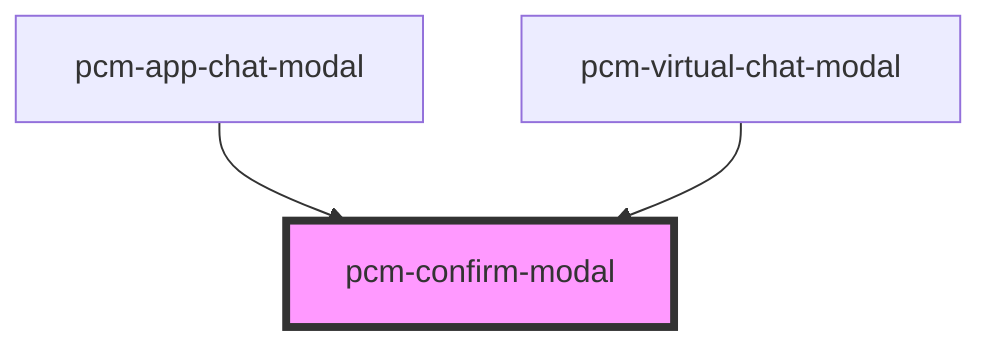

<!-- Auto Generated Below -->

## Overview

确认模态框组件
通用的确认对话框组件，类似 Ant Design 的 Modal 组件

## Properties

| Property       | Attribute        | Description                    | Type                                 | Default     |
| -------------- | ---------------- | ------------------------------ | ------------------------------------ | ----------- |
| `cancelText`   | `cancel-text`    | 取消按钮文本                         | `string`                             | `'取消'`      |
| `centered`     | `centered`       | 是否居中显示                         | `boolean`                            | `true`      |
| `isOpen`       | `is-open`        | 模态框是否可见                        | `boolean`                            | `false`     |
| `mask`         | `mask`           | 是否显示蒙层                         | `boolean`                            | `true`      |
| `maskClosable` | `mask-closable`  | 点击蒙层是否允许关闭                     | `boolean`                            | `true`      |
| `modalTitle`   | `modal-title`    | 模态框标题                          | `string`                             | `'确认'`      |
| `okText`       | `ok-text`        | 确认按钮文本                         | `string`                             | `'确认'`      |
| `okType`       | `ok-type`        | 确认按钮类型                         | `"danger" \| "default" \| "primary"` | `'primary'` |
| `parentZIndex` | `parent-z-index` | 父级模态框的z-index值，确认模态框会在此基础上增加层级 | `number`                             | `undefined` |

## Events

| Event        | Description | Type                |
| ------------ | ----------- | ------------------- |
| `afterClose` | 模态框关闭后的回调   | `CustomEvent<void>` |
| `afterOpen`  | 模态框打开后的回调   | `CustomEvent<void>` |
| `cancel`     | 取消按钮点击事件    | `CustomEvent<void>` |
| `closed`     | 模态框关闭后的回调   | `CustomEvent<void>` |
| `ok`         | 确认按钮点击事件    | `CustomEvent<void>` |

## Methods

### `close() => Promise<void>`

关闭模态框

#### Returns

Type: `Promise<void>`

### `open() => Promise<void>`

打开模态框

#### Returns

Type: `Promise<void>`

## Dependencies

### Used by

 - [pcm-app-chat-modal](../pcm-app-chat-modal)
 - [pcm-virtual-chat-modal](../pcm-virtual-chat-modal)

### Graph

----------------------------------------------

*Built with [StencilJS](https://stenciljs.com/)*
