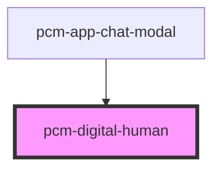

<!-- Auto Generated Below -->

## Properties

| Property      | Attribute      | Description        | Type      | Default     |
| ------------- | -------------- | ------------------ | --------- | ----------- |
| `digitalId`   | `digital-id`   | 数字人ID，用于指定数字人形象    | `string`  | `undefined` |
| `isStreaming` | `is-streaming` | 是否正在流式输出           | `boolean` | `false`     |
| `speechText`  | `speech-text`  | AI回答的文本内容，用于后续获取视频 | `string`  | `''`        |

## Events

| Event                | Description | Type                                                               |
| -------------------- | ----------- | ------------------------------------------------------------------ |
| `avatarDetailLoaded` | 数字人详情加载完成事件 | `CustomEvent<{ defaultVideoUrl: string; virtualmanKey: string; }>` |
| `videoEnded`         | 视频播放完成事件    | `CustomEvent<{ videoUrl: string; }>`                               |
| `videoGenerated`     | 视频生成成功事件    | `CustomEvent<{ videoUrl: string; }>`                               |

## Dependencies

### Used by

 - [pcm-app-chat-modal](../pcm-app-chat-modal)

### Graph

----------------------------------------------

*Built with [StencilJS](https://stenciljs.com/)*
