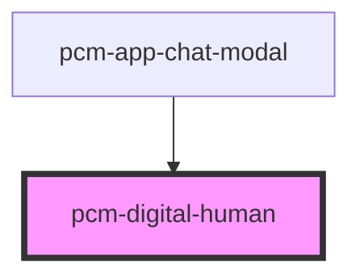

<!-- Auto Generated Below -->

## Properties

| Property          | Attribute           | Description        | Type      | Default                                                                                                                                                  |
| ----------------- | ------------------- | ------------------ | --------- | -------------------------------------------------------------------------------------------------------------------------------------------------------- |
| `avatar`          | `avatar`            | 头像URL              | `string`  | `'https://virtualhuman-cos-test-1251316161.cos.ap-nanjing.myqcloud.com/prod/resource-manager/small/57/158/23228/model_32764_20250321201819/preview.png'` |
| `defaultVideoUrl` | `default-video-url` | 默认视频URL            | `string`  | `'https://pcm-resource-1312611446.cos.ap-guangzhou.myqcloud.com/shuziren/db18e00cdce54a64bdcfe826c01fdd3e.webm'`                                         |
| `isStreaming`     | `is-streaming`      | 是否正在流式输出           | `boolean` | `false`                                                                                                                                                  |
| `speechText`      | `speech-text`       | AI回答的文本内容，用于后续获取视频 | `string`  | `''`                                                                                                                                                     |

## Events

| Event        | Description | Type                                 |
| ------------ | ----------- | ------------------------------------ |
| `videoEnded` | 视频播放完成事件    | `CustomEvent<{ videoUrl: string; }>` |

## Dependencies

### Used by

 - [pcm-app-chat-modal](../pcm-app-chat-modal)

### Graph

----------------------------------------------

*Built with [StencilJS](https://stenciljs.com/)*
