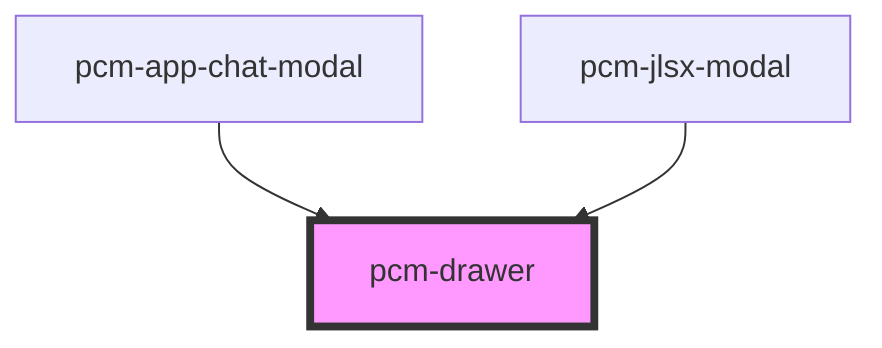

<!-- Auto Generated Below -->

## Overview

抽屉组件
从屏幕边缘滑出的浮层面板，类似 Ant Design 的 Drawer 组件

## Properties

| Property       | Attribute       | Description                       | Type      | Default   |
| -------------- | --------------- | --------------------------------- | --------- | --------- |
| `closable`     | `closable`      | 是否显示关闭按钮                          | `boolean` | `true`    |
| `drawerTitle`  | `drawer-title`  | 抽屉标题                              | `string`  | `''`      |
| `height`       | `height`        | 高度，在 placement 为 top 或 bottom 时使用 | `string`  | `'378px'` |
| `isOpen`       | `is-open`       | 抽屉是否可见                            | `boolean` | `false`   |
| `mask`         | `mask`          | 是否显示蒙层                            | `boolean` | `true`    |
| `maskClosable` | `mask-closable` | 点击蒙层是否允许关闭                        | `boolean` | `true`    |
| `width`        | `width`         | 宽度，可以是像素值或百分比                     | `string`  | `'378px'` |

## Events

| Event        | Description | Type                |
| ------------ | ----------- | ------------------- |
| `afterClose` | 抽屉关闭后的回调    | `CustomEvent<void>` |
| `afterOpen`  | 抽屉打开后的回调    | `CustomEvent<void>` |
| `closed`     | 抽屉关闭后的回调    | `CustomEvent<void>` |

## Methods

### `close() => Promise<void>`

关闭抽屉

#### Returns

Type: `Promise<void>`

### `open() => Promise<void>`

打开抽屉

#### Returns

Type: `Promise<void>`

## Dependencies

### Used by

 - [pcm-app-chat-modal](../pcm-app-chat-modal)
 - [pcm-jlsx-modal](../pcm-jlsx-modal)

### Graph

----------------------------------------------

*Built with [StencilJS](https://stenciljs.com/)*
