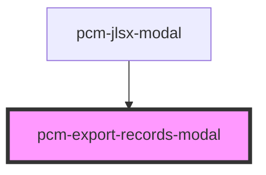

<!-- Auto Generated Below -->

## Properties

| Property   | Attribute   | Description | Type      | Default     |
| ---------- | ----------- | ----------- | --------- | ----------- |
| `botId`    | `bot-id`    |             | `string`  | `undefined` |
| `open`     | `open`      |             | `boolean` | `false`     |
| `sourceId` | `source-id` |             | `string`  | `undefined` |

## Events

| Event    | Description | Type                |
| -------- | ----------- | ------------------- |
| `cancel` |             | `CustomEvent<void>` |

## Dependencies

### Used by

 - [pcm-jlsx-modal](../pcm-jlsx-modal)

### Graph

----------------------------------------------

*Built with [StencilJS](https://stenciljs.com/)*
