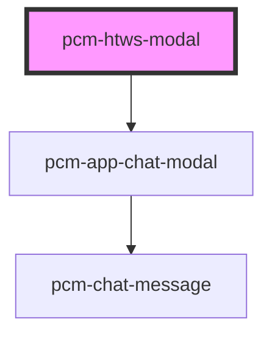

<!-- Auto Generated Below -->

## Overview

劳动合同卫士

## Properties

| Property             | Attribute         | Description                                | Type                    | Default     |
| -------------------- | ----------------- | ------------------------------------------ | ----------------------- | ----------- |
| `conversationId`     | `conversation-id` | 会话ID，传入继续对话，否则创建新会话                        | `string`                | `undefined` |
| `customInputs`       | `custom-inputs`   | 自定义输入参数，传入customInputs.input时，会自动切换到自由输入模式 | `{ [x: string]: any; }` | `{}`        |
| `defaultQuery`       | `default-query`   | 默认查询文本                                     | `string`                | `'请开始分析'`   |
| `fullscreen`         | `fullscreen`      | 是否以全屏模式打开，移动端建议设置为true                     | `boolean`               | `false`     |
| `icon`               | `icon`            | 应用图标URL                                    | `string`                | `undefined` |
| `isNeedClose`        | `is-need-close`   | 是否展示右上角的关闭按钮                               | `boolean`               | `true`      |
| `isOpen`             | `is-open`         | 是否显示聊天模态框                                  | `boolean`               | `false`     |
| `isShowHeader`       | `is-show-header`  | 是否展示顶部标题栏                                  | `boolean`               | `true`      |
| `modalTitle`         | `modal-title`     | 模态框标题                                      | `string`                | `'劳动合同卫士'`  |
| `token` _(required)_ | `token`           | SDK鉴权密钥                                    | `string`                | `undefined` |
| `zIndex`             | `z-index`         | 聊天框的页面层级                                   | `number`                | `1000`      |

## Events

| Event               | Description             | Type                                      |
| ------------------- | ----------------------- | ----------------------------------------- |
| `conversationStart` | 新会话开始的回调，只会在一轮对话开始时触发一次 | `CustomEvent<ConversationStartEventData>` |
| `interviewComplete` | 当聊天完成时触发                | `CustomEvent<InterviewCompleteEventData>` |
| `modalClosed`       | 当点击模态框关闭时触发             | `CustomEvent<void>`                       |
| `streamComplete`    | 流式输出完成事件                | `CustomEvent<StreamCompleteEventData>`    |
| `tokenInvalid`      | SDK密钥验证失败事件             | `CustomEvent<void>`                       |
| `uploadSuccess`     | 上传成功事件                  | `CustomEvent<FileUploadResponse>`         |

## Dependencies

### Depends on

- [pcm-app-chat-modal](../pcm-app-chat-modal)

### Graph

----------------------------------------------

*Built with [StencilJS](https://stenciljs.com/)*
