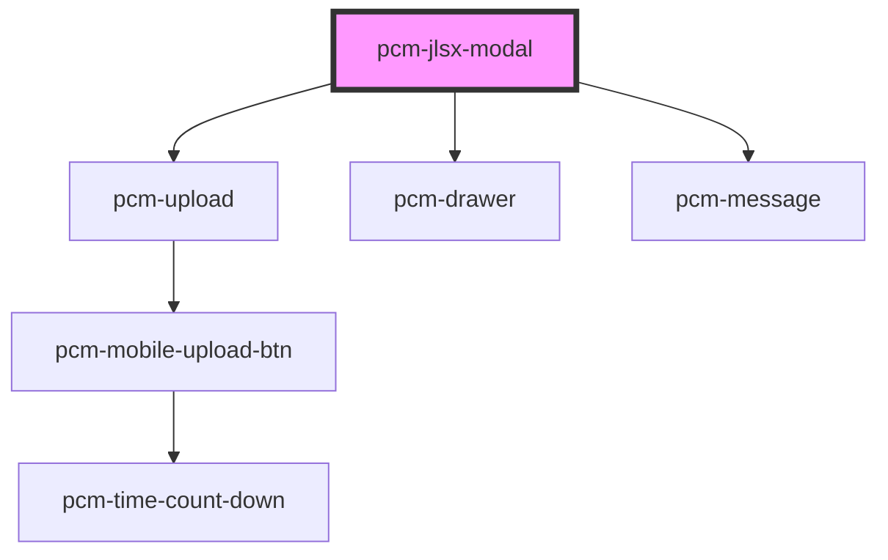

<!-- Auto Generated Below -->

## Properties

| Property             | Attribute            | Description                                    | Type                       | Default     |
| -------------------- | -------------------- | ---------------------------------------------- | -------------------------- | ----------- |
| `customInputs`       | `custom-inputs`      | 自定义输入参数，传入customInputs.job_info时，会填充JD输入区域  | `{ [x: string]: string; }` | `{}`        |
| `fullscreen`         | `fullscreen`         | 是否以全屏模式打开，移动端建议设置为true                         | `boolean`                  | `false`     |
| `icon`               | `icon`               | 应用图标URL                                        | `string`                   | `undefined` |
| `isNeedClose`        | `is-need-close`      | 是否展示右上角的关闭按钮                                   | `boolean`                  | `true`      |
| `isOpen`             | `is-open`            | 是否显示聊天模态框                                      | `boolean`                  | `false`     |
| `isShowHeader`       | `is-show-header`     | 是否展示顶部标题栏                                      | `boolean`                  | `true`      |
| `mobileUploadAble`   | `mobile-upload-able` | 是否开启移动端上传简历（仅PC端生效）                            | `boolean`                  | `false`     |
| `modalTitle`         | `modal-title`        | 模态框标题                                          | `string`                   | `'简历筛选精灵'`  |
| `token` _(required)_ | `token`              | SDK鉴权密钥                                        | `string`                   | `undefined` |
| `zIndex`             | `z-index`            | 聊天框的页面层级                                       | `number`                   | `1000`      |

## Events

| Event                    | Description | Type                                           |
| ------------------------ | ----------- | ---------------------------------------------- |
| `modalClosed`            | 当点击模态框关闭时触发 | `CustomEvent<void>`                            |
| `resumeAnalysisComplete` | 简历分析完成事件    | `CustomEvent<ResumeAnalysisCompleteEventData>` |
| `resumeAnalysisStart`    | 简历分析开始事件    | `CustomEvent<ResumeAnalysisStartEventData>`    |
| `resumeDeleted`          | 简历删除事件      | `CustomEvent<ResumeDeletedEventData>`          |
| `someErrorEvent`         | 错误事件        | `CustomEvent<ErrorEventDetail>`                |
| `taskCreated`            | 任务创建完成事件    | `CustomEvent<TaskCreatedEventData>`            |
| `taskSwitch`             | 任务切换事件      | `CustomEvent<TaskSwitchEventData>`             |
| `tokenInvalid`           | SDK密钥验证失败事件 | `CustomEvent<void>`                            |
| `uploadSuccess`          | 上传成功事件      | `CustomEvent<FileUploadResponse>`              |

## Dependencies

### Depends on

- [pcm-upload](../pcm-upload)
- [pcm-drawer](../pcm-drawer)
- [pcm-message](../pcm-message)

### Graph

----------------------------------------------

*Built with [StencilJS](https://stenciljs.com/)*
