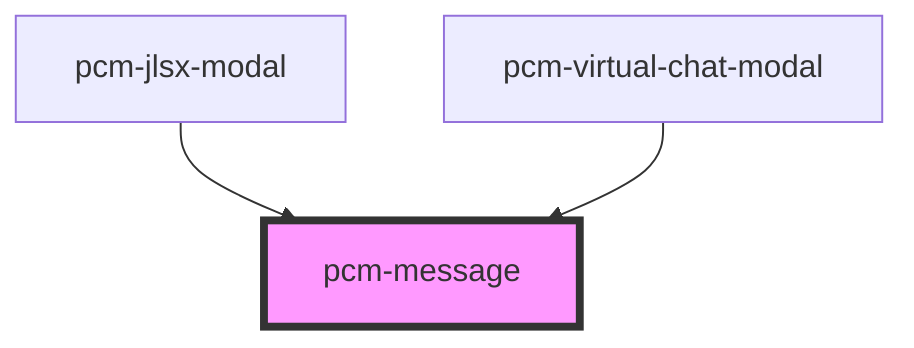

<!-- Auto Generated Below -->

## Properties

| Property   | Attribute  | Description | Type                                          | Default  |
| ---------- | ---------- | ----------- | --------------------------------------------- | -------- |
| `content`  | `content`  |             | `string`                                      | `''`     |
| `duration` | `duration` |             | `number`                                      | `3000`   |
| `type`     | `type`     |             | `"error" \| "info" \| "success" \| "warning"` | `'info'` |

## Methods

### `close() => Promise<void>`

#### Returns

Type: `Promise<void>`

### `show() => Promise<void>`

#### Returns

Type: `Promise<void>`

## Dependencies

### Used by

 - [pcm-jlsx-modal](../pcm-jlsx-modal)
 - [pcm-virtual-chat-modal](../pcm-virtual-chat-modal)

### Graph

----------------------------------------------

*Built with [StencilJS](https://stenciljs.com/)*
