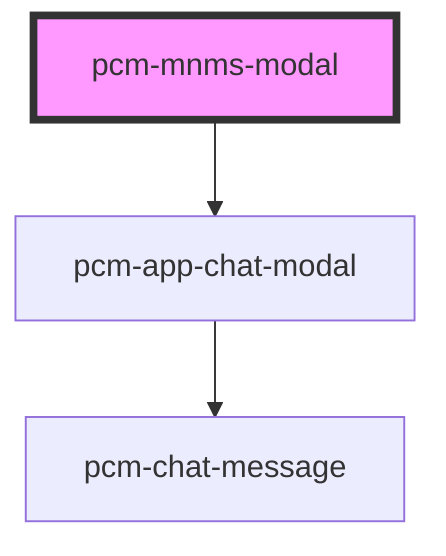

<!-- Auto Generated Below -->

## Properties

| Property         | Attribute         | Description  | Type                      | Default     |
| ---------------- | ----------------- | ------------ | ------------------------- | ----------- |
| `apiKey`         | `api-key`         | API鉴权密钥      | `string`                  | `''`        |
| `conversationId` | `conversation-id` | 会话ID         | `string`                  | `undefined` |
| `customInputs`   | --                | 自定义输入参数      | `{ [key: string]: any; }` | `{}`        |
| `defaultQuery`   | `default-query`   | 默认查询文本       | `string`                  | `''`        |
| `fullscreen`     | `fullscreen`      | 是否以全屏模式打开    | `boolean`                 | `false`     |
| `icon`           | `icon`            | 应用图标URL      | `string`                  | `undefined` |
| `isMobile`       | `is-mobile`       | 是否为移动端布局     | `boolean`                 | `false`     |
| `isNeedClose`    | `is-need-close`   | 是否展示右上角的关闭按钮 | `boolean`                 | `true`      |
| `isOpen`         | `is-open`         | 是否显示聊天模态框    | `boolean`                 | `false`     |
| `isShowHeader`   | `is-show-header`  | 是否展示顶部标题栏    | `boolean`                 | `true`      |
| `modalTitle`     | `modal-title`     | 模态框标题        | `string`                  | `'在线客服'`    |
| `zIndex`         | `z-index`         | 聊天框的页面层级     | `number`                  | `1000`      |

## Events

| Event               | Description             | Type                                                                                       |
| ------------------- | ----------------------- | ------------------------------------------------------------------------------------------ |
| `conversationStart` | 新会话开始的回调，只会在一轮对话开始时触发一次 | `CustomEvent<{ conversation_id: string; event: string; message_id: string; id: string; }>` |
| `interviewComplete` | 当聊天完成时触发                | `CustomEvent<{ conversation_id: string; total_questions: number; }>`                       |
| `modalClosed`       | 当点击模态框关闭时触发             | `CustomEvent<void>`                                                                        |
| `streamComplete`    | 流式输出完成事件                | `CustomEvent<{ conversation_id: string; event: string; message_id: string; id: string; }>` |
| `uploadSuccess`     | 上传成功事件                  | `CustomEvent<{ cos_key: string; filename: string; ext: string; presigned_url: string; }>`  |

## Dependencies

### Depends on

- [pcm-app-chat-modal](../pcm-app-chat-modal)

### Graph

----------------------------------------------

*Built with [StencilJS](https://stenciljs.com/)*
