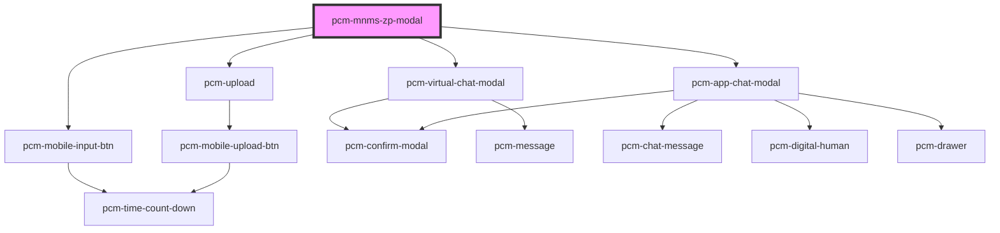

<!-- Auto Generated Below -->

## Overview

模拟面试

## Properties

| Property                 | Attribute                   | Description                                                                                                                                                                                                                                                                                                                                                                                                                                                                                                                                 | Type                       | Default     |
| ------------------------ | --------------------------- | ------------------------------------------------------------------------------------------------------------------------------------------------------------------------------------------------------------------------------------------------------------------------------------------------------------------------------------------------------------------------------------------------------------------------------------------------------------------------------------------------------------------------------------------- | -------------------------- | ----------- |
| `conversationId`         | `conversation-id`           | 会话ID，传入继续对话，否则创建新会话                                                                                                                                                                                                                                                                                                                                                                                                                                                                                                                         | `string`                   | `undefined` |
| `customInputs`           | `custom-inputs`             | 自定义输入参数，可传入以下参数：  customInputs.job_info时，会隐藏JD输入区域。  customInputs.file_url或customInputs.resume_content时，会隐藏简历上传区域。  customInputs.file_url（或customInputs.resume_content）和customInputs.job_info时，会直接开始聊天。  customInputs.resume_content：可传入json字符串，或纯文本字符串，字符串内容为简历内容。  customInputs.url_callback：可传入url字符串，当报告生成后，会调用该url进行回调。该url请使用post请求，接收报告字段为report_content，会话id字段为conversation_id。  customInputs.interview_type：可传入数字，传入 1 时，开启题目连续模式，一次性生成所有题目。不传入或传入其他值时，题目将逐个生成。  customInputs.question_number时，会设置面试题总数量。  | `{ [x: string]: string; }` | `{}`        |
| `defaultQuery`           | `default-query`             | 默认查询文本                                                                                                                                                                                                                                                                                                                                                                                                                                                                                                                                      | `string`                   | `'请开始模拟面试'` |
| `digitalId`              | `digital-id`                | 虚拟数字人ID，指定则开启虚拟数字人功能                                                                                                                                                                                                                                                                                                                                                                                                                                                                                                                        | `string`                   | `undefined` |
| `enableVirtualHuman`     | `enable-virtual-human`      | 是否启用全屏虚拟数字人模式，此模式下面试结果只会通过interviewComplete事件返回或者通过url_callback回调返回                                                                                                                                                                                                                                                                                                                                                                                                                                                                         | `boolean`                  | `false`     |
| `fullscreen`             | `fullscreen`                | 是否以全屏模式打开，移动端建议设置为true                                                                                                                                                                                                                                                                                                                                                                                                                                                                                                                      | `boolean`                  | `false`     |
| `icon`                   | `icon`                      | 应用图标URL                                                                                                                                                                                                                                                                                                                                                                                                                                                                                                                                     | `string`                   | `undefined` |
| `interviewMode`          | `interview-mode`            | 面试模式：text - 文本模式，video - 视频模式                                                                                                                                                                                                                                                                                                                                                                                                                                                                                                               | `"text" \| "video"`        | `'text'`    |
| `isNeedClose`            | `is-need-close`             | 是否展示右上角的关闭按钮                                                                                                                                                                                                                                                                                                                                                                                                                                                                                                                                | `boolean`                  | `true`      |
| `isOpen`                 | `is-open`                   | 是否显示聊天模态框                                                                                                                                                                                                                                                                                                                                                                                                                                                                                                                                   | `boolean`                  | `false`     |
| `isShowHeader`           | `is-show-header`            | 是否展示顶部标题栏                                                                                                                                                                                                                                                                                                                                                                                                                                                                                                                                   | `boolean`                  | `true`      |
| `maxRecordingTime`       | `max-recording-time`        | 视频录制最大时长（秒）默认120                                                                                                                                                                                                                                                                                                                                                                                                                                                                                                                            | `number`                   | `120`       |
| `mobileJdInputAble`      | `mobile-jd-input-able`      | 是否开启移动端上传JD（仅PC端生效）                                                                                                                                                                                                                                                                                                                                                                                                                                                                                                                         | `boolean`                  | `false`     |
| `mobileUploadAble`       | `mobile-upload-able`        | 是否开启移动端上传简历（仅PC端生效）                                                                                                                                                                                                                                                                                                                                                                                                                                                                                                                         | `boolean`                  | `false`     |
| `modalTitle`             | `modal-title`               | 模态框标题                                                                                                                                                                                                                                                                                                                                                                                                                                                                                                                                       | `string`                   | `'模拟面试'`    |
| `openingIndex`           | `opening-index`             | 数字人开场白索引，用于选择开场白和开场视频（可选：0, 1, 2） 0、您好，我是聘才猫 AI 面试助手。很高兴为你主持这场面试！在开始前，请确保：身处安静、光线充足的环境。网络顺畅，摄像头和麦克风工作正常。现在我正在查看本次面试的相关信息，为您生成专属面试题，马上就好，请稍等片刻。  1、您好，我是您的 AI 面试助手。欢迎参加本次AI面试！为了获得最佳效果，请确认：您在安静、明亮的环境中。您的网络稳定，摄像头和麦克风已开启。我们正在后台为您准备本次专属面试内容，很快开始，请稍候。  2、您好，我是您的 AI 面试助手。面试马上开始。趁此片刻，请快速确认：周围安静吗？光线足够吗？网络没问题？摄像头和麦克风准备好了吗？我们正在为您加载个性化的面试环节，稍等就好！                                                                                                                                                                                      | `number`                   | `0`         |
| `showCopyButton`         | `show-copy-button`          | 是否显示复制按钮                                                                                                                                                                                                                                                                                                                                                                                                                                                                                                                                    | `boolean`                  | `true`      |
| `showEndInterviewButton` | `show-end-interview-button` | 是否显示结束面试按钮                                                                                                                                                                                                                                                                                                                                                                                                                                                                                                                                  | `boolean`                  | `false`     |
| `showFeedbackButtons`    | `show-feedback-buttons`     | 是否显示点赞点踩按钮                                                                                                                                                                                                                                                                                                                                                                                                                                                                                                                                  | `boolean`                  | `true`      |
| `showWorkspaceHistory`   | `show-workspace-history`    | 是否显示工作区历史会话按钮                                                                                                                                                                                                                                                                                                                                                                                                                                                                                                                               | `boolean`                  | `false`     |
| `token` _(required)_     | `token`                     | SDK鉴权密钥                                                                                                                                                                                                                                                                                                                                                                                                                                                                                                                                     | `string`                   | `undefined` |
| `waitingTime`            | `waiting-time`              | 等待录制时间（秒）默认10                                                                                                                                                                                                                                                                                                                                                                                                                                                                                                                               | `number`                   | `10`        |
| `zIndex`                 | `z-index`                   | 聊天框的页面层级                                                                                                                                                                                                                                                                                                                                                                                                                                                                                                                                    | `number`                   | `1000`      |

## Events

| Event               | Description             | Type                                      |
| ------------------- | ----------------------- | ----------------------------------------- |
| `conversationStart` | 新会话开始的回调，只会在一轮对话开始时触发一次 | `CustomEvent<ConversationStartEventData>` |
| `interviewComplete` | 当聊天完成时触发                | `CustomEvent<InterviewCompleteEventData>` |
| `modalClosed`       | 当点击模态框关闭时触发             | `CustomEvent<void>`                       |
| `recordingError`    | 录制错误事件                  | `CustomEvent<RecordingErrorEventData>`    |
| `someErrorEvent`    | 错误事件                    | `CustomEvent<ErrorEventDetail>`           |
| `streamComplete`    | 流式输出完成事件                | `CustomEvent<StreamCompleteEventData>`    |
| `tokenInvalid`      | SDK密钥验证失败事件             | `CustomEvent<void>`                       |
| `uploadSuccess`     | 上传成功事件                  | `CustomEvent<FileUploadResponse>`         |

## Dependencies

### Depends on

- [pcm-mobile-input-btn](../pcm-mobile-input-btn)
- [pcm-upload](../pcm-upload)
- [pcm-virtual-chat-modal](../pcm-virtual-chat-modal)
- [pcm-app-chat-modal](../pcm-app-chat-modal)

### Graph

----------------------------------------------

*Built with [StencilJS](https://stenciljs.com/)*
