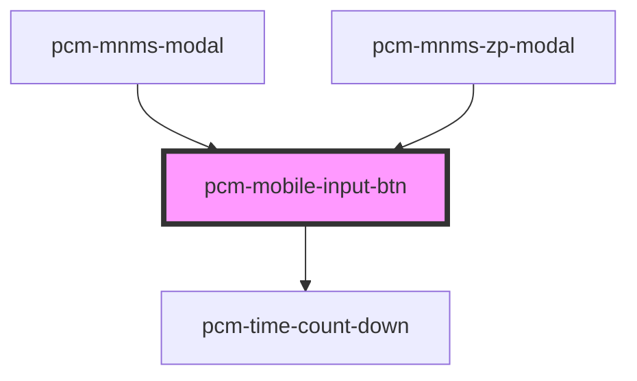

<!-- Auto Generated Below -->

## Properties

| Property        | Attribute        | Description | Type                    | Default     |
| --------------- | ---------------- | ----------- | ----------------------- | ----------- |
| `maxLength`     | `max-length`     | 最大文件大小      | `number`                | `undefined` |
| `name`          | `name`           |             | `string`                | `''`        |
| `rows`          | `rows`           | 最大文件数       | `number`                | `8`         |
| `uploadHeaders` | `upload-headers` | 填写请求头       | `{ [x: string]: any; }` | `undefined` |
| `uploadParams`  | `upload-params`  | 填写请求参数      | `{ [x: string]: any; }` | `undefined` |

## Events

| Event | Description | Type                  |
| ----- | ----------- | --------------------- |
| `ok`  |             | `CustomEvent<string>` |

## Dependencies

### Used by

 - [pcm-mnms-modal](../pcm-mnms-modal)
 - [pcm-mnms-zp-modal](../pcm-mnms-zp-modal)

### Depends on

- [pcm-time-count-down](../pcm-time-count-down)

### Graph

----------------------------------------------

*Built with [StencilJS](https://stenciljs.com/)*
