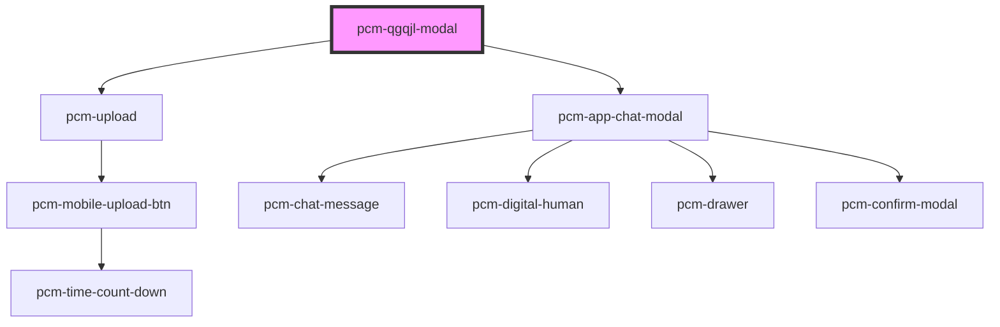

<!-- Auto Generated Below -->

## Overview

千岗千简历

## Properties

| Property               | Attribute                | Description                                                                                                                                        | Type                       | Default        |
| ---------------------- | ------------------------ | -------------------------------------------------------------------------------------------------------------------------------------------------- | -------------------------- | -------------- |
| `conversationId`       | `conversation-id`        | 会话ID，传入继续对话，否则创建新会话                                                                                                                                | `string`                   | `undefined`    |
| `customInputs`         | `custom-inputs`          | 自定义输入参数，传入customInputs.job_info时，会隐藏JD输入区域  传入customInputs.file_url时，会隐藏简历上传区域。  传入customInputs.file_url和customInputs.job_info时，会直接开始聊天。  | `{ [x: string]: string; }` | `{}`           |
| `defaultQuery`         | `default-query`          | 默认查询文本                                                                                                                                             | `string`                   | `'请开始出题'`      |
| `exportButtonText`     | `export-button-text`     | 导出按钮的文本                                                                                                                                            | `string`                   | `'导出简历json数据'` |
| `filePreviewMode`      | `file-preview-mode`      | 附件预览模式 'drawer': 在右侧抽屉中预览 'window': 在新窗口中打开                                                                                                        | `"drawer" \| "window"`     | `'window'`     |
| `fullscreen`           | `fullscreen`             | 是否以全屏模式打开，移动端建议设置为true                                                                                                                             | `boolean`                  | `false`        |
| `hideExportButton`     | `hide-export-button`     | 是否隐藏导出数据按钮                                                                                                                                         | `boolean`                  | `false`        |
| `icon`                 | `icon`                   | 应用图标URL                                                                                                                                            | `string`                   | `undefined`    |
| `isNeedClose`          | `is-need-close`          | 是否展示右上角的关闭按钮                                                                                                                                       | `boolean`                  | `true`         |
| `isOpen`               | `is-open`                | 是否显示聊天模态框                                                                                                                                          | `boolean`                  | `false`        |
| `isShowHeader`         | `is-show-header`         | 是否展示顶部标题栏                                                                                                                                          | `boolean`                  | `true`         |
| `mobileUploadAble`     | `mobile-upload-able`     | 是否开启移动端上传简历（仅PC端生效）                                                                                                                                | `boolean`                  | `false`        |
| `modalTitle`           | `modal-title`            | 模态框标题                                                                                                                                              | `string`                   | `'千岗千简历'`      |
| `showWorkspaceHistory` | `show-workspace-history` | 是否显示工作区历史会话按钮                                                                                                                                      | `boolean`                  | `false`        |
| `token` _(required)_   | `token`                  | SDK鉴权密钥                                                                                                                                            | `string`                   | `undefined`    |
| `zIndex`               | `z-index`                | 聊天框的页面层级                                                                                                                                           | `number`                   | `1000`         |

## Events

| Event               | Description                 | Type                                      |
| ------------------- | --------------------------- | ----------------------------------------- |
| `conversationStart` | 新会话开始的回调，只会在一轮对话开始时触发一次     | `CustomEvent<ConversationStartEventData>` |
| `getResumeData`     | 获取简历数据事件（用户点击导出简历json数据后触发） | `CustomEvent<any>`                        |
| `interviewComplete` | 当聊天完成时触发                    | `CustomEvent<InterviewCompleteEventData>` |
| `modalClosed`       | 当点击模态框关闭时触发                 | `CustomEvent<void>`                       |
| `someErrorEvent`    | 错误事件                        | `CustomEvent<ErrorEventDetail>`           |
| `streamComplete`    | 流式输出完成事件                    | `CustomEvent<StreamCompleteEventData>`    |
| `tokenInvalid`      | SDK密钥验证失败事件                 | `CustomEvent<void>`                       |
| `uploadSuccess`     | 上传成功事件                      | `CustomEvent<FileUploadResponse>`         |

## Dependencies

### Depends on

- [pcm-upload](../pcm-upload)
- [pcm-app-chat-modal](../pcm-app-chat-modal)

### Graph

----------------------------------------------

*Built with [StencilJS](https://stenciljs.com/)*
