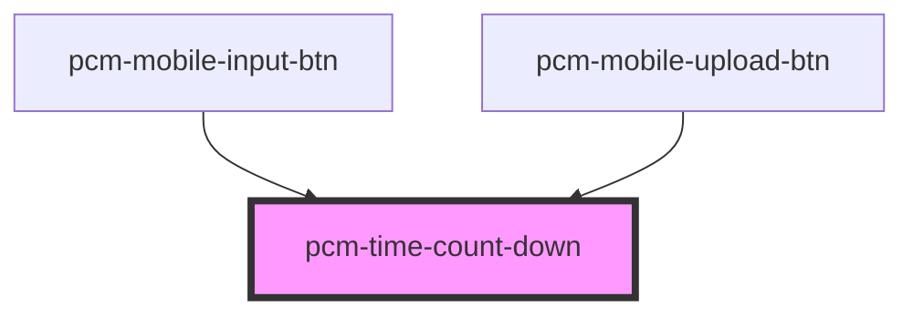

<!-- Auto Generated Below -->

## Properties

| Property | Attribute | Description | Type     | Default     |
| -------- | --------- | ----------- | -------- | ----------- |
| `time`   | `time`    | 倒计时总秒数      | `number` | `undefined` |

## Events

| Event      | Description | Type               |
| ---------- | ----------- | ------------------ |
| `finished` | 倒计时结束事件     | `CustomEvent<any>` |

## Dependencies

### Used by

 - [pcm-mobile-input-btn](../pcm-mobile-input-btn)
 - [pcm-mobile-upload-btn](../pcm-mobile-upload-btn)

### Graph

----------------------------------------------

*Built with [StencilJS](https://stenciljs.com/)*
