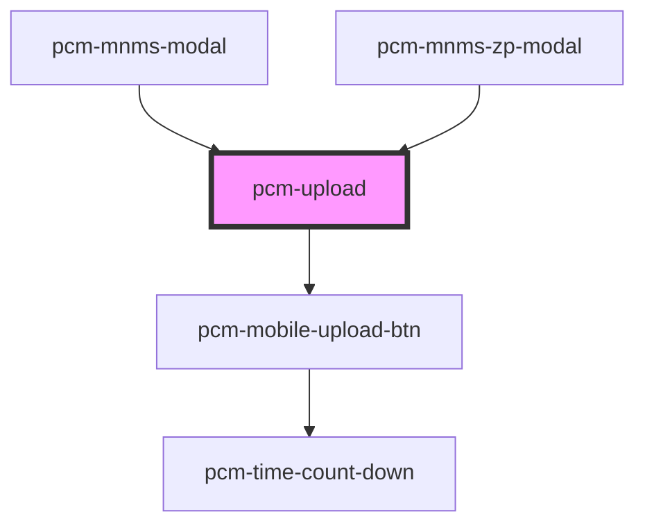

<!-- Auto Generated Below -->

## Properties

| Property               | Attribute                 | Description         | Type                    | Default     |
| ---------------------- | ------------------------- | ------------------- | ----------------------- | ----------- |
| `acceptFileSuffixList` | `accept-file-suffix-list` | 支持的文件后缀列表（需要带上小数点.） | `string[]`              | `[]`        |
| `labelText`            | `label-text`              | label内容             | `string`                | `'上传文件'`    |
| `maxFileCount`         | `max-file-count`          | 最大文件数               | `number`                | `Infinity`  |
| `maxFileSize`          | `max-file-size`           | 最大文件大小              | `number`                | `Infinity`  |
| `mobileUploadAble`     | `mobile-upload-able`      | 是否开启移动端上传（仅PC端生效）   | `boolean`               | `false`     |
| `multiple`             | `multiple`                | 是否支持多文件上传           | `boolean`               | `false`     |
| `uploadHeaders`        | `upload-headers`          | 上传请求头               | `{ [x: string]: any; }` | `undefined` |
| `uploadParams`         | `upload-params`           | 上传请求参数              | `{ [x: string]: any; }` | `undefined` |

## Events

| Event          | Description | Type                                              |
| -------------- | ----------- | ------------------------------------------------- |
| `uploadChange` | 上传文件变化监听    | `CustomEvent<FileUploadResponse[]>`               |
| `uploadFailed` | 上传失败监听      | `CustomEvent<{ error: Error; message: string; }>` |

## Methods

### `getIsUploading() => Promise<boolean>`

#### Returns

Type: `Promise<boolean>`

## Dependencies

### Used by

 - [pcm-mnms-modal](../pcm-mnms-modal)
 - [pcm-mnms-zp-modal](../pcm-mnms-zp-modal)

### Depends on

- [pcm-mobile-upload-btn](../pcm-mobile-upload-btn)

### Graph

----------------------------------------------

*Built with [StencilJS](https://stenciljs.com/)*
