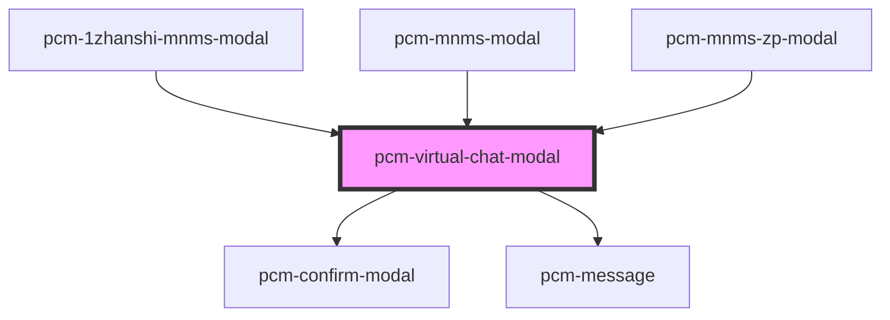

<!-- Auto Generated Below -->

## Properties

| Property               | Attribute                | Description                                                                                                                                                                                                                                                                                                                                            | Type                    | Default     |
| ---------------------- | ------------------------ | ------------------------------------------------------------------------------------------------------------------------------------------------------------------------------------------------------------------------------------------------------------------------------------------------------------------------------------------------------ | ----------------------- | ----------- |
| `botId`                | `bot-id`                 | 机器人ID                                                                                                                                                                                                                                                                                                                                                  | `string`                | `undefined` |
| `conversationId`       | `conversation-id`        | 会话ID，传入继续对话，否则创建新会话                                                                                                                                                                                                                                                                                                                                    | `string`                | `undefined` |
| `countdownWarningTime` | `countdown-warning-time` | 录制倒计时提醒时间（秒） 当剩余时间小于此值时，显示倒计时警告                                                                                                                                                                                                                                                                                                                        | `number`                | `30`        |
| `customInputs`         | `custom-inputs`          | 自定义智能体inputs输入参数                                                                                                                                                                                                                                                                                                                                       | `{ [x: string]: any; }` | `{}`        |
| `defaultQuery`         | `default-query`          | 默认发送文本                                                                                                                                                                                                                                                                                                                                                 | `string`                | `'你好！聘才猫'`  |
| `digitalId`            | `digital-id`             | 虚拟数字人ID，指定则开启虚拟数字人功能                                                                                                                                                                                                                                                                                                                                   | `string`                | `undefined` |
| `fullscreen`           | `fullscreen`             | 是否以全屏模式打开，移动端建议设置为true                                                                                                                                                                                                                                                                                                                                 | `boolean`               | `false`     |
| `isOpen`               | `is-open`                | 是否显示聊天模态框                                                                                                                                                                                                                                                                                                                                              | `boolean`               | `false`     |
| `maxRecordingTime`     | `max-recording-time`     | 视频录制最大时长（秒）                                                                                                                                                                                                                                                                                                                                            | `number`                | `120`       |
| `openingIndex`         | `opening-index`          | 数字人开场白索引，用于选择开场白和开场视频（可选：0, 1, 2） 0、您好，我是聘才猫 AI 面试助手。很高兴为你主持这场面试！在开始前，请确保：身处安静、光线充足的环境。网络顺畅，摄像头和麦克风工作正常。现在我正在查看本次面试的相关信息，为您生成专属面试题，马上就好，请稍等片刻。  1、您好，我是您的 AI 面试助手。欢迎参加本次AI面试！为了获得最佳效果，请确认：您在安静、明亮的环境中。您的网络稳定，摄像头和麦克风已开启。我们正在后台为您准备本次专属面试内容，很快开始，请稍候。  2、您好，我是您的 AI 面试助手。面试马上开始。趁此片刻，请快速确认：周围安静吗？光线足够吗？网络没问题？摄像头和麦克风准备好了吗？我们正在为您加载个性化的面试环节，稍等就好！ | `number`                | `0`         |
| `token`                | `token`                  | SDK鉴权密钥                                                                                                                                                                                                                                                                                                                                                | `string`                | `undefined` |
| `zIndex`               | `z-index`                | 聊天框的页面层级                                                                                                                                                                                                                                                                                                                                               | `number`                | `undefined` |

## Events

| Event                   | Description             | Type                                          |
| ----------------------- | ----------------------- | --------------------------------------------- |
| `conversationStart`     | 新会话开始的回调，只会在一轮对话开始时触发一次 | `CustomEvent<ConversationStartEventData>`     |
| `interviewComplete`     | 当聊天完成时触发                | `CustomEvent<InterviewCompleteEventData>`     |
| `modalClosed`           | 当点击模态框关闭时触发             | `CustomEvent<void>`                           |
| `recordingError`        | 录制错误事件                  | `CustomEvent<RecordingErrorEventData>`        |
| `recordingStatusChange` | 录制状态变化事件                | `CustomEvent<RecordingStatusChangeEventData>` |
| `streamComplete`        | 一轮对话结束时的回调              | `CustomEvent<StreamCompleteEventData>`        |
| `tokenInvalid`          | SDK密钥验证失败事件             | `CustomEvent<void>`                           |

## Dependencies

### Used by

 - [pcm-1zhanshi-mnms-modal](../pcm-1zhanshi-mnms-modal)
 - [pcm-mnms-modal](../pcm-mnms-modal)
 - [pcm-mnms-zp-modal](../pcm-mnms-zp-modal)

### Depends on

- [pcm-confirm-modal](../pcm-confirm-modal)
- [pcm-message](../pcm-message)

### Graph

----------------------------------------------

*Built with [StencilJS](https://stenciljs.com/)*
