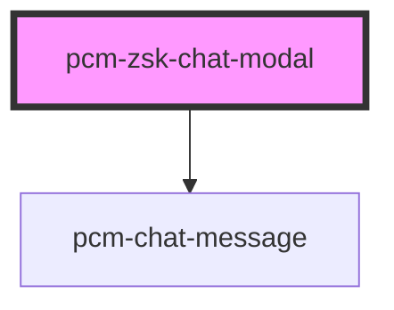

<!-- Auto Generated Below -->

## Properties

| Property                  | Attribute                  | Description                   | Type                    | Default     |
| ------------------------- | -------------------------- | ----------------------------- | ----------------------- | ----------- |
| `conversationId`          | `conversation-id`          | 会话ID，传入继续对话，否则创建新会话           | `string`                | `undefined` |
| `customInputs`            | --                         | 自定义智能体inputs输入参数              | `{ [x: string]: any; }` | `{}`        |
| `employeeId` _(required)_ | `employee-id`              | 数字员工ID，从聘才猫开发平台创建数字员工后，点击导出获取 | `string`                | `undefined` |
| `fullscreen`              | `fullscreen`               | 是否以全屏模式打开，移动端建议设置为true        | `boolean`               | `false`     |
| `icon`                    | `icon`                     | 应用图标URL                       | `string`                | `undefined` |
| `isNeedClose`             | `is-need-close`            | 是否展示右上角的关闭按钮                  | `boolean`               | `true`      |
| `isOpen`                  | `is-open`                  | 是否显示聊天模态框                     | `boolean`               | `false`     |
| `isShowHeader`            | `is-show-header`           | 是否展示顶部标题栏                     | `boolean`               | `true`      |
| `maxAudioRecordingTime`   | `max-audio-recording-time` | 语音录制最大时长（秒）                   | `number`                | `60`        |
| `modalTitle`              | `modal-title`              | 模态框标题                         | `string`                | `'在线客服'`    |
| `showReferences`          | `show-references`          | 是否显示引用文档                      | `boolean`               | `true`      |
| `showSuggestedQuestions`  | `show-suggested-questions` | 是否显示推荐问题                      | `boolean`               | `false`     |
| `token` _(required)_      | `token`                    | SDK鉴权密钥                       | `string`                | `undefined` |
| `zIndex`                  | `z-index`                  | 聊天框的页面层级                      | `number`                | `1000`      |

## Events

| Event               | Description             | Type                                                                                       |
| ------------------- | ----------------------- | ------------------------------------------------------------------------------------------ |
| `conversationStart` | 新会话开始的回调，只会在一轮对话开始时触发一次 | `CustomEvent<{ conversation_id: string; event: string; message_id: string; id: string; }>` |
| `modalClosed`       | 当点击模态框关闭时触发             | `CustomEvent<void>`                                                                        |
| `streamComplete`    | 一轮对话结束时的回调              | `CustomEvent<{ conversation_id: string; event: string; message_id: string; id: string; }>` |
| `tokenInvalid`      | SDK密钥验证失败事件             | `CustomEvent<void>`                                                                        |

## Dependencies

### Depends on

- [pcm-chat-message](../pcm-chat-message)

### Graph

----------------------------------------------

*Built with [StencilJS](https://stenciljs.com/)*
