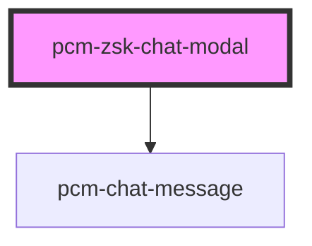

<!-- Auto Generated Below -->

## Properties

| Property                  | Attribute                  | Description                                             | Type                       | Default                                        |
| ------------------------- | -------------------------- | ------------------------------------------------------- | -------------------------- | ---------------------------------------------- |
| `conversationId`          | `conversation-id`          | 会话ID，传入继续对话，否则创建新会话                                     | `string`                   | `undefined`                                    |
| `customInputs`            | `custom-inputs`            | 自定义智能体inputs输入参数: 1. show_suggested_questions: 是否显示推荐问题 | `{ [x: string]: string; }` | `{     show_suggested_questions: 'false',   }` |
| `employeeId` _(required)_ | `employee-id`              | 数字员工ID，从聘才猫开发平台创建数字员工后，点击导出获取                           | `string`                   | `undefined`                                    |
| `fullscreen`              | `fullscreen`               | 是否以全屏模式打开，移动端建议设置为true                                  | `boolean`                  | `false`                                        |
| `icon`                    | `icon`                     | 应用图标URL，如果未设置则使用智能体头像                                   | `string`                   | `undefined`                                    |
| `isNeedClose`             | `is-need-close`            | 是否展示右上角的关闭按钮                                            | `boolean`                  | `true`                                         |
| `isOpen`                  | `is-open`                  | 是否显示聊天模态框                                               | `boolean`                  | `false`                                        |
| `isShowHeader`            | `is-show-header`           | 是否展示顶部标题栏                                               | `boolean`                  | `true`                                         |
| `maxAudioRecordingTime`   | `max-audio-recording-time` | 语音录制最大时长（秒）                                             | `number`                   | `60`                                           |
| `modalTitle`              | `modal-title`              | 模态框标题                                                   | `string`                   | `undefined`                                    |
| `token` _(required)_      | `token`                    | SDK鉴权密钥                                                 | `string`                   | `undefined`                                    |
| `zIndex`                  | `z-index`                  | 聊天框的页面层级                                                | `number`                   | `1000`                                         |

## Events

| Event               | Description             | Type                                      |
| ------------------- | ----------------------- | ----------------------------------------- |
| `clearConversation` | 当点击清除对话记录按钮时触发          | `CustomEvent<string>`                     |
| `conversationStart` | 新会话开始的回调，只会在一轮对话开始时触发一次 | `CustomEvent<ConversationStartEventData>` |
| `modalClosed`       | 当点击模态框关闭时触发             | `CustomEvent<void>`                       |
| `streamComplete`    | 一轮对话结束时的回调              | `CustomEvent<StreamCompleteEventData>`    |
| `tokenInvalid`      | SDK密钥验证失败事件             | `CustomEvent<void>`                       |

## Dependencies

### Depends on

- [pcm-chat-message](../pcm-chat-message)

### Graph

----------------------------------------------

*Built with [StencilJS](https://stenciljs.com/)*
